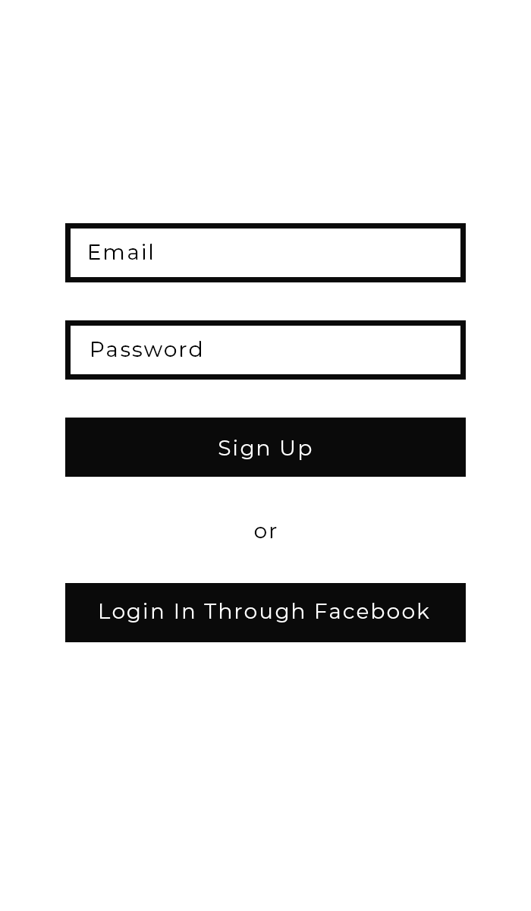
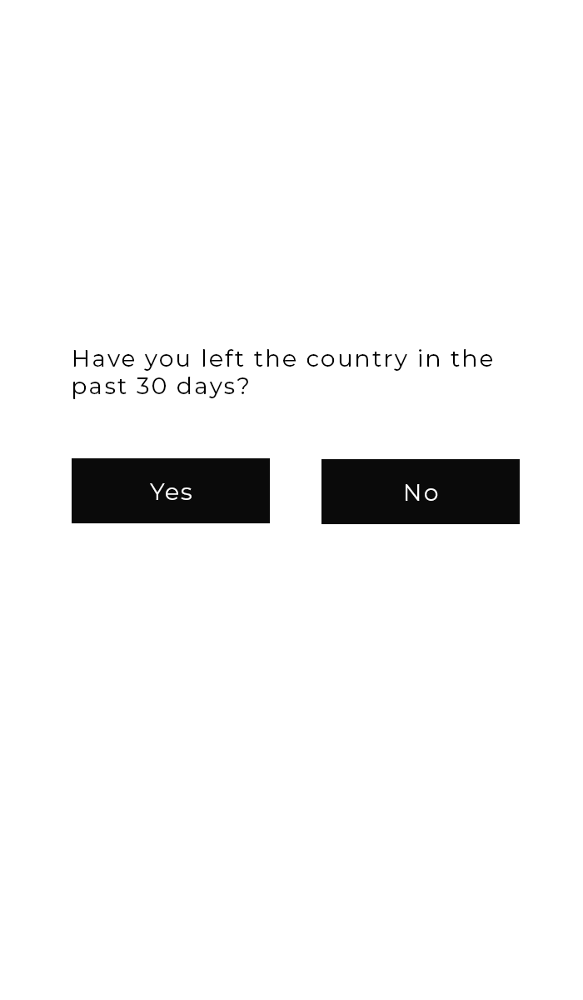
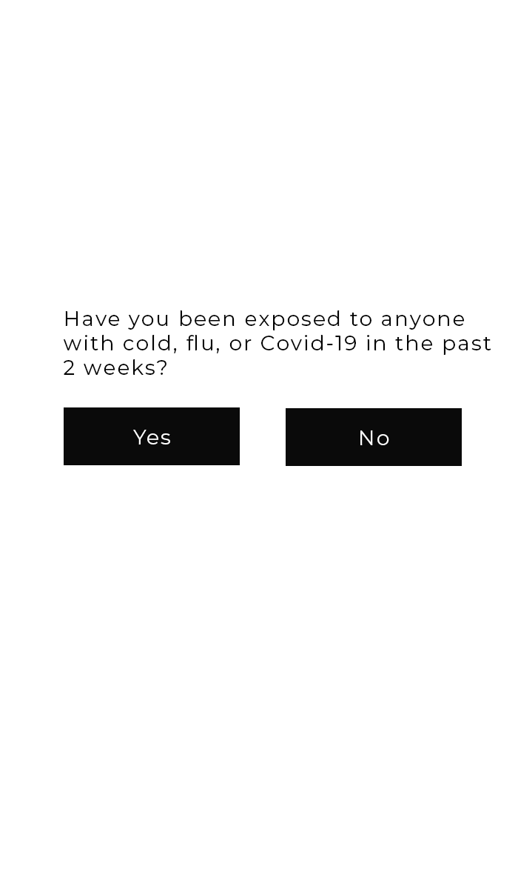
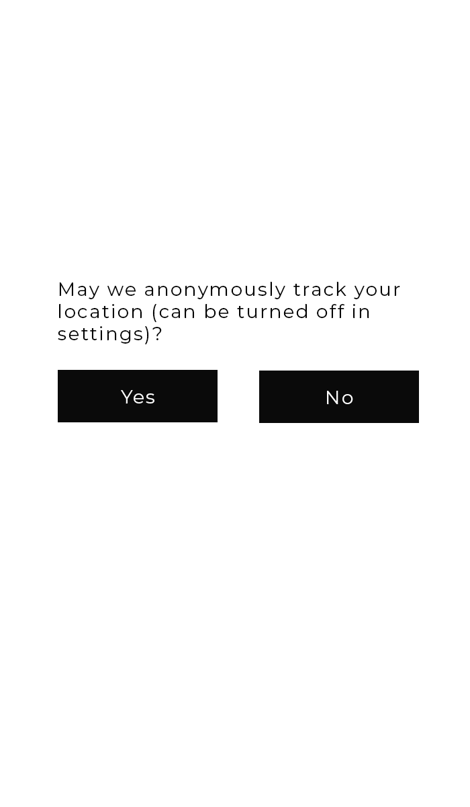
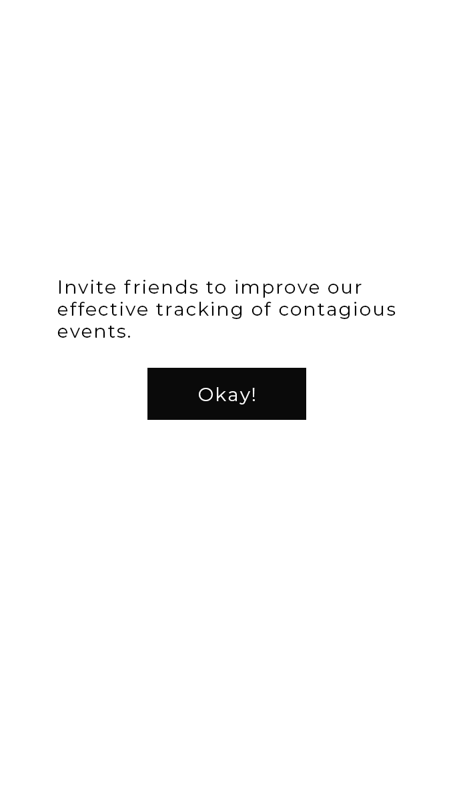
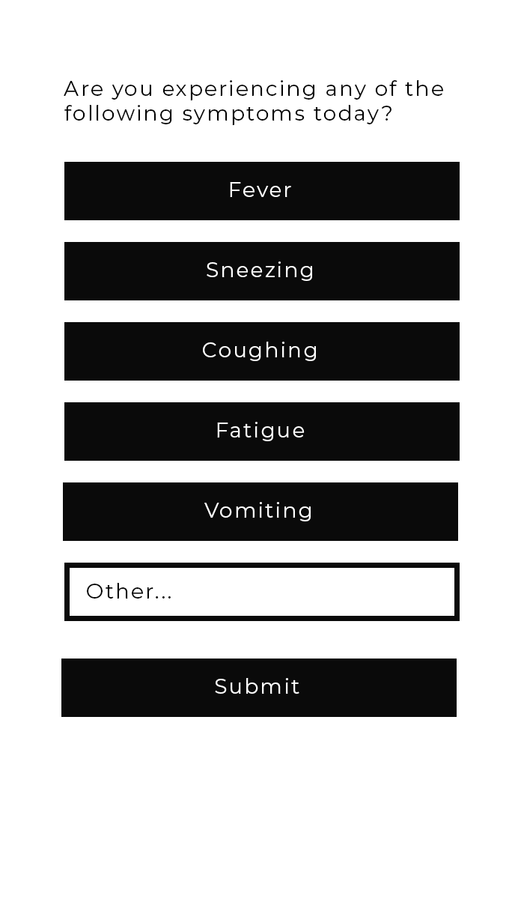
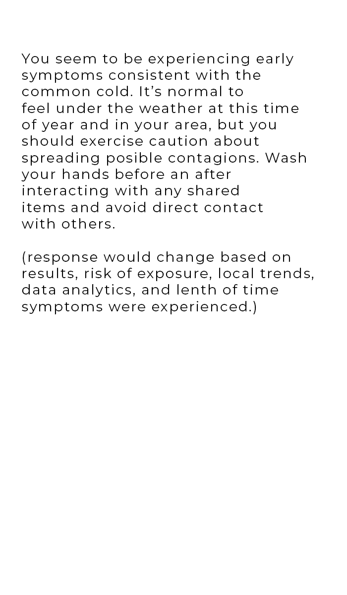
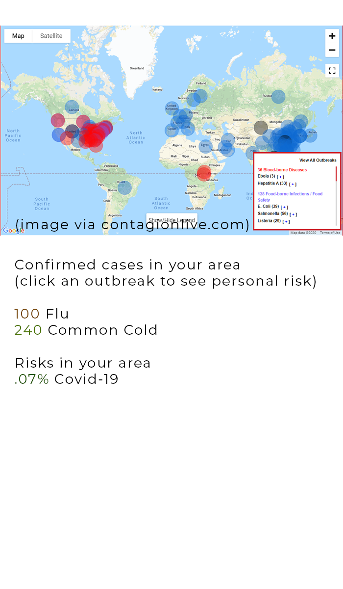
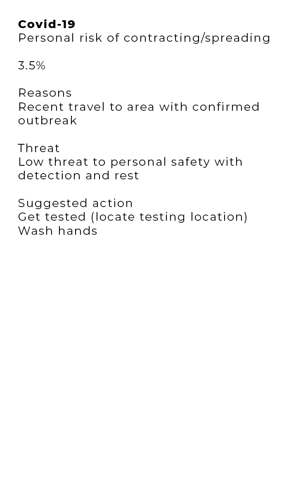

Epidemic
=======

A symptom and outbreak-confirmation based tracker for the movement, spread, and resilience of epidemic events.

This is a framework for a platform to help track epidemic movement based on analyzing generalized data. The idea of to create a heat map of symptoms and confirmations so you can have coordinated and organized quarantine and health service. This is largely to help provide real time transpancy for the public and for experts needing consistent user-submitted data. Due to inconsistencies from the [early reporting](https://www.cnbc.com/2020/02/15/heres-why-the-white-house-doesnt-trust-chinas-coronavirus-numbers.html) and [tracking styles](https://www.nytimes.com/2020/02/12/world/asia/china-coronavirus-cases.html) for the Covid-19 virus from China and [small initial sample sizes](http://www.cidrap.umn.edu/news-perspective/2020/02/cdc-warns-us-covid-19-spread-labs-frustrated-over-lack-tests) and [unpreperation](https://www.livescience.com/covid-19-coronovirus-test.html) in the United States, trust worthy input regarding the disease's spread was hard to discern. This allows us to collect, share, and spread information in a sensible, rather than sensational fashion.

[Current Deployment](https://epidemic-tracker.herokuapp.com/)

### Basic Premise

1) New users will onboard with a survey assessment of their recent activity and geographic locations
2) Once on boarded, users will be prompted daily with a single question survey about any symptoms they have noticed along with a geocoded check in
3) Users will then be prompted to share the platform with friends in their networks
4) The platform homepage will provide charts, maps, graphs, statistics, and analyses of anonymized aggregated user informationto demonstrate a heat map of contagion and epidemiological activity
5) APIs will be provided for scientific and expert analysis
6) Triggers and warnings for different thresholds of heat map activity will send notifications to users to act insensible, non sensationalized, and efficacious ways in response to data. For example, the beginning of flu and cold seasons will remind users to increase the rate at which they wash hands. Confirmed cases of contagious vectors will alert caution. Increased activity could recommend and even locate vaccination centers. Confirmed spread of epidemic events based on geographic information as well as attributes of the contagion including incubation time, virality, and severity
7) Information about nearby contagions can be sent from the platform to users to provide information regarding the diseases with factual, accurate data from credible sources.
8) Anonymized data made accessible and available to authorities, epidemiologists, and a scientific communityare able to contribute to real time informationto help assess the actual spread of multiple epidemic events at once.
9) Analysis based on the appearance of certain symptoms, time between the appearance of symptoms and confirmed cases, length of time symptoms appear, and rates at which symptoms are demonstrated based on geographic check-ins can be analyzed to provide statistical assessments of the likelihood of given diseases and provide that information as a heat map of multiple contagions at once.

#### Goals

This project began around the third month of the spread of Novel Corono Virus (Covid-19) in late Februrary of 2020. The initial goals was to find a way to contribute to the science of tracking the spread and nature of the virus. The reason I thought of this is the apparent weirdness of the covid-19 incubation period. It seemed if we could track first instances of symptoms, length of infection, and recovery time then we could find the data points to do intelligent quarantine and on-premise preemptive care based on [agreed upon criteria](ecdc.europa.eu/en/case-definition-and-european-surveillance-human-infection-novel-coronavirus-2019-ncov). Between H1N1, Zika, SARS, Ebola, whooping cough, etc, there have been several mild to major outbreaks over the past decades and I've never seen a central platform for telemedicine based live vector updates. 

I wanted to track symptoms, confirmed cases, risk, and aid scientists with sanitized live data like the [John Hopkins live feed](https://gisanddata.maps.arcgis.com/apps/opsdashboard/index.html#/bda7594740fd40299423467b48e9ecf6) and [other visualizations](http://www.cidrap.umn.edu/covid-19/maps-visuals) but with real time predictions based on symptom cases. I knew it had to be open source and transparent data to meet those goals.

The ideal scenario is this goes exactly right and gets several thousand users before we get into triple digit confirmed infections in the US. Futher, it could get over 1 million users, and be part of building  a huge enough community to control panic from misinformation. Worst case is it's executed totally wrong, leads to more misinformation then leaks the identity of infected individuals to the public causing panic and harm to them. These two scenarios underscore the importance of carefulness and integrity in this project.

### Mockups

The following are mockups of how the system is intended to work from the side of end-user behavior. 

#### Login Screen

#### Onboarding Step 1

#### Onboarding Step 2

#### Onboarding Step 3

#### Share and Invite

#### Main (Daily) Survey

#### Survey Results

#### Main Dashboard

#### Deep Dive

The Client
-------

The client is a user interface that sends you a daily notification for a single question survey. "Which if any of these symptoms are you experiencing?" You answer, it anonymizes your answer and gives it a broad location check-in. Simple way to track vectors for long incubation endemic diseases. Results will be published and help coordinate tracking and alerts. 

The Server
-------

Simply a collection of trends based on individual users (agents), their self reported assessment of symptoms, and their general geographic activity.

### Objects
[Table Diagram](https://sketchboard.me/TBirsgCXpxjx#/)
- User
- Account
- Account Meta
	- Name
	- Category
	- Type
	- Value
	- Default Privacy
	- Special Privacy
- Settings
	- Name
	- Value
- Checkins
- Reponses
	- Checkin
	- Question
	- Response
- Symptoms
	- Name
	- ICD10 Code
	- Description
- Outbreak
	- Outbreak Type (Pathogen, etc)
	- ICD10 Code
	- Incubation Time
	- Contagiousness (R0)
	- Severity
	- Discovery (Introduction)
	- Outbreak Status
- Outbreak Meta
	- Name
	- Type
	- Value
- Outbreak Statuses
- Outbreak Transmission Styles (Contact, Airborn, Venereal)
- Outbreak Confirmations
	- Outbreak
	- Location
	- Datetime
- Treatments
	- Name
	- Type
	- Description
	- Rating
- Treatment Types (Diagnosis, Preventative, Recovery)
- Protocols (Survey Questions)
- Protocol Questions
	- Protocol
	- Type
	- Question
	- Ordinance
- Protocol Answer Options
	- Protocol Question
	- Protocol Answer
	- Ordinance

License
-------

Open-source software licensed under the [MIT license](https://opensource.org/licenses/MIT).

Current Challenges
-------

Questions
1) what are the HIPAA compliance measures needed to be made by nonentities to protect the storage of anonymized medical data?
2) what are the international considerations for the aggregation of information and the tracking of user activity?
3) what organizations provide the most credible information regarding epidemiological tracking systems?
4) what organizations provide the most accurate information regarding standard operating procedure during contagion events (CDC)?
5) what are the best considerations to make regarding a platform upon which to deploy this project (aws, heroku, open stack, etc)?
6) what existing third-party data analysis platforms exist specifically for this type of analysis (watson)?
7) what level of anonymity should be excercised (best practices)?
8) how narrow should geo check-in track and how wide should it report back?